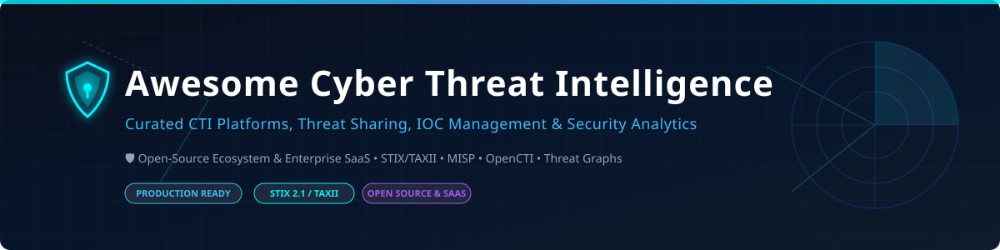

  

# Awesome Cyber Threat Intelligence (CTI) 🛡️

  
  
  
  
  
  

---

**Curated List of SaaS Products & Open-Source GitHub Projects** 🌐

*Focused on Threat Intelligence Platforms (TIP), IOC Management, Threat Sharing & Security Analytics* 🔍

**Last updated: October 2026** 📅

This repository tracks notable **SaaS platforms** ☁️ and **open-source projects** 🔓 for **Cyber Threat Intelligence (CTI)**. These tools help security teams collect, analyze, and operationalize threat data from multiple sources—enriching alerts, tracking adversaries, and sharing intelligence across trusted communities.

**Examples** include Microsoft Defender Threat Intelligence, Recorded Future, Mandiant Threat Intelligence, CrowdStrike Falcon Intelligence, Flashpoint, Anomali, Palo Alto Unit 42, IntSights (Rapid7), ZeroFox, and Cybersixgill (the category leaders).

**Open-source emphasis**: The open-source CTI ecosystem is **exceptionally mature and production-proven**. **MISP** (Malware Information Sharing Platform) is the de-facto standard for threat sharing with **5,964 GitHub stars**, used by **over 6,000 organizations worldwide** 🌍. **OpenCTI** provides a modern STIX 2.1 knowledge graph with **9,900 GitHub stars** and active development 🚀. **TheHive** offers incident response case management with **3,843 stars** 🐝. **IntelOwl** delivers scalable threat analysis with AI-powered enrichment (GSoC 2026) 🦉. This section documents these production-grade solutions.

Contributions welcome! 🤝 Open a PR to add/update entries. Keep descriptions factual and link to official sites.

---

## 📖 Table of Contents

- [☁️ SaaS/Hosted Platforms](#-saashosted-platforms)
- [🔓 Open-Source GitHub Projects](#-open-source-github-projects)
- [🤝 How to Contribute](#-how-to-contribute)
- [💖 Support & Sponsorship](#-support--sponsorship)
- [📈 Star History](#-star-history)
- [⚠️ Disclaimer](#-disclaimer)

---

## ☁️ SaaS/Hosted Platforms

> **📊 Market Context**: The global Cyber Threat Intelligence market is estimated at **~$14.5B in 2026**, growing toward **~$35B by 2032** at a **~16% CAGR** 📈. The sector is **moderately concentrated** — **Mandiant** (Google Cloud) leads with operationally validated intelligence from frontline breach investigations, **Recorded Future** dominates on volume of intelligence sources, and **CrowdStrike** integrates threat intelligence directly into its Falcon platform 🦅. **Pricing varies dramatically**: Mandiant starts at **~$18,000/year per module**, while enterprise full-platform contracts exceed **$100,000/year** 💰. **OpenCTI Enterprise Edition** SaaS instances start at **~$250,000/year** on AWS Marketplace 🏷️. No single vendor holds a winner-take-all position; enterprises typically run multi-vendor intelligence stacks.

| Platform | Description | Pricing (Starting Tier) | Free Tier Limits | Company Size |
|----------|-------------|------------------------|------------------|--------------|
| **[Mandiant Threat Intelligence](https://www.mandiant.com/advantage/threat-intelligence)** | **Most operationally validated CTI platform.** Built on Mandiant's 20+ years of frontline breach investigations, now backed by Google's global telemetry and VirusTotal. **300+ named threat actor profiles**. Gartner MQ Leader, Forrester Wave Leader, IDC MarketScape Leader 🏆. | **~$18,000/year per module**; enterprise full-platform on quote. Typically exceeds **$100,000/year** for large enterprises 💵. | **Mandiant Advantage free tier**: Basic intelligence access for small teams. Enterprise trial via sales 🎁. | **Acquired by Google for $5.4B (2022)** 🏢 |
| **[Recorded Future](https://www.recordedfuture.com/)** | **Largest intelligence source volume.** Aggregates from open web, dark web, technical sources, and human analysis. **AI Alert Filtering** reduces alert volume by **~63%** 🤖. | **Custom enterprise pricing** — quote required. Entry contracts typically **$50,000–$150,000/year** based on modules. | **None** — enterprise demo required. | **Private (~$1B+ valuation est.)** 🏢 |
| **[CrowdStrike Falcon Intelligence](https://www.crowdstrike.com/)** | **Integrated with CrowdStrike Falcon platform.** Threat intelligence derived from adversary tracking and incident response. | **Custom enterprise pricing** — quote required. Bundled with Falcon platform subscriptions. | **None** — enterprise demo required. | **~$4B revenue (CrowdStrike FY2025)** 🏢 |
| **[Microsoft Defender Threat Intelligence](https://www.microsoft.com/en-us/security/business/siem-and-xdr/microsoft-defender-threat-intelligence)** | **Microsoft's CTI within Defender XDR.** Enriches incidents with threat actor profiles, IOCs, and intelligence from Microsoft's global sensor network. | **Custom enterprise pricing** — quote required. Bundled with Defender XDR or Microsoft 365 E5. | **Free tier**: Limited threat intelligence via Microsoft Defender portal 🎁. | **~$281B revenue (Microsoft FY2025)** 🏢 |
| **[Anomali](https://www.anomali.com/)** | **Threat intelligence platform with curated intelligence feeds.** Aggregates and normalizes from 100+ sources. | **Custom enterprise pricing** — quote required. Entry contracts typically **$60,000/year**. | **Free trial available** on request 🎁. | **Private (~$100M+ raised)** 🏢 |
| **[Flashpoint](https://www.flashpoint-intel.com/)** | **Dark web and cybercrime intelligence specialist.** Focus on fraud, ransomware, and threat actor communities 🕵️. | **Custom enterprise pricing** — quote required. Entry contracts typically **$50,000/year**. | **None** — enterprise demo required. | **Private (~$100M+ raised)** 🏢 |
| **[Palo Alto Unit 42](https://unit42.paloaltonetworks.com/)** | **Palo Alto Networks' threat intelligence.** Research-driven intelligence from Unit 42 threat researchers, integrated with Cortex XDR. | **Custom enterprise pricing** — quote required. Bundled with Cortex XDR/PAN-OS subscriptions. | **Unit 42 blog and research**: Free public access 🎁. Enterprise intel requires subscription. | **~$9.2B revenue (Palo Alto FY2025)** 🏢 |
| **[ZeroFox](https://www.zerofox.com/)** | **Digital risk protection and external threat intelligence.** Social media monitoring, phishing detection, and brand protection 🦊. | **Custom enterprise pricing** — quote required. | **None** — enterprise demo required. | **Private (~$250M+ raised)** 🏢 |
| **[Cybersixgill](https://www.cybersixgill.com/)** | **Deep and dark web intelligence.** Real-time insights from underground forums and markets 🌊. | **Custom enterprise pricing** — quote required. | **None** — enterprise demo required. | **Private (~$100M+ raised)** 🏢 |

---

## 🔓 Open-Source GitHub Projects

Sorted by star count (descending). Star badge links to each repo's stargazers page. ⭐

| Repo | Description | Stars |
|---|---|---|
| **[OpenCTI](https://github.com/OpenCTI-Platform/opencti)** — **The leading open-source threat intelligence platform.** Modern STIX 2.1 knowledge graph storing every threat actor, malware, indicator, and ATT&CK technique as typed, relationship-linked objects 🌐. **Connectors for MITRE ATT&CK, CVE/NVD, AlienVault OTX, Abuse.ch, VirusTotal, Mandiant, Recorded Future, ISAC/government TAXII feeds** 🔗. **9.9K stars**, active development 🚀. **Autonomous import** via connectors, streams, TAXII feeds, RSS, CSV, JSON. **AGPL-3.0** (Community Edition). |  | ~9,900 |
| **[MISP](https://github.com/MISP/MISP)** — **The de-facto standard for threat intelligence sharing.** Open Source Threat Intelligence and Sharing Platform (formerly Malware Information Sharing Platform) 🛡️. **5,964 stars**, used by **6,000+ organizations worldwide** 🌍. **83 repositories** in the MISP organization including PyMISP, misp-objects, misp-taxonomies, MISP-STIX-Converter, and misp-playbooks. Core format specifications, best practices, and RFCs published. **AGPL-3.0**. |  | ~5,964 |
| **[TheHive](https://github.com/TheHive-Project/TheHive)** — **Scalable, open-source security incident response platform.** Case management with alerts, observables, tasks, and collaboration 🐝. **3,843 stars**. Integrates with MISP and Cortex analyzers. **AGPL-3.0**. |  | ~3,843 |
| **[Yeti](https://github.com/yeti-platform/yeti)** — **Your Everyday Threat Intelligence platform.** Organize observables, indicators, and TTPs with a graph-based model 🦶. **1,949 stars**, 313 forks, Apache-2.0 licensed, actively maintained. Python-based with REST API and web UI. |  | ~1,949 |
| **[IntelOwl](https://github.com/intelowlproject/IntelOwl)** — **Analyze files, domains, IPs in multiple ways from a single API at scale.** 🦉 **GSoC 2026 additions**: LangChain ReAct agent with job tools, chatbot WebSocket with token streaming, per-user rate limiting, Ollama integration for local LLM enrichment 🤖. **AGPL-3.0**. |  | ~1,500 |
| **[CIFv3 (Collective Intelligence Framework)](https://github.com/csirtgadgets/bearded-avenger)** — **The fastest way to consume threat intelligence.** Aggregates IOCs from multiple sources, supports sharing and scoring ⚡. Deployment kit and Docker container available. |  | ~1,200 |
| **[ioc-fanger](https://github.com/ioc-fang/ioc-fanger)** — **Fang and defang indicators of compromise.** CLI tool for safe IOC handling in reports and sharing 🐍. |  | ~500 |

**Additional open-source options worth exploring:** 🔍

| Repo | Description |
|---|---|
| **[MISP-STIX-Converter](https://github.com/MISP/MISP-STIX-Converter)** — Utility for converting between MISP and STIX formats 🔄. |
| **[PyMISP](https://github.com/MISP/PyMISP)** — Python library for MISP API access 🐍. |
| **[misp-playbooks](https://github.com/MISP/misp-playbooks)** — Automated response playbooks for MISP 📘. |
| **[Graylog Threat Intel Plugin](https://github.com/Graylog2/graylog-plugin-threatintel)** — Enrich log messages with IOC data from threat intelligence databases 🪵. |
| **[MISP-QRadar-Integration](https://github.com/karthikkbala/MISP-QRadar-Integration)** — Integrate QRadar with MISP Threat Sharing Platform 📡. |

---

## 🤝 How to Contribute

1. Fork the repo. 🍴
2. Add/edit entries in `README.md` (follow existing format). 📝
3. Include: name, link, 1–2 sentence description, and whether it's SaaS or open-source. 💡
4. Submit PR with a short explanation. 🚀

Star the repo if you find it useful! ⭐

---

## 💖 Support & Sponsorship

If you find this repository helpful for your SOC team, threat intelligence research, or security architecture, please consider supporting the project! 

- ⭐ **Star** this repository to help others discover it.
- 🔄 **Fork** and share it with fellow security professionals.
- ☕ **Buy me a coffee / Sponsor**: Support ongoing maintenance and curation on the [Sponsor Dashboard](https://github.com/sponsors/ishandutta2007).

Thank you for being part of the cybersecurity community! 🙌

---

## 📈 Star History

---

## ⚠️ Disclaimer

- This is a **community-curated** list — not exhaustive and not an endorsement.
- CTI platforms handle sensitive threat intelligence and potentially classified data; ensure proper access controls and compliance with information sharing agreements 🔐.
- **Open-source reality**: The open-source ecosystem for CTI is **exceptionally mature and production-proven**. **MISP** is the de-facto standard for threat sharing with **5,964 stars** and **6,000+ organizational users**. **OpenCTI** provides a modern STIX 2.1 knowledge graph with **9,900 stars** and autonomous import from **MITRE ATT&CK, CVE/NVD, AlienVault OTX, Abuse.ch, VirusTotal, Mandiant, Recorded Future, and government TAXII feeds**. **TheHive** delivers incident response case management with **3,843 stars**. **IntelOwl** brings AI-powered enrichment with LangChain ReAct agents and Ollama integration. However, **commercial platforms** (Mandiant, Recorded Future, CrowdStrike) provide **operationally validated intelligence from frontline incident response, broader source coverage, and dedicated analyst support** that open-source alternatives require significant curation effort to match. The open-source path is **genuinely viable** for organizations with strong CTI engineering capacity.
- **Pricing caveat**: All pricing figures are **verified against cited search results** but may change without notice. **Mandiant starts at ~$18,000/year per module**. **OpenCTI Enterprise Edition SaaS** starts at **$250,000/year** on AWS Marketplace. Always request a formal quote for accurate budgeting 💰.

---

  <b>Made for SOC analysts, threat intelligence engineers, incident responders, and security architects.</b> 🛡️ 
  <i>Let's make cyber threat intelligence more open, transparent, and collaborative.</i> ✨

